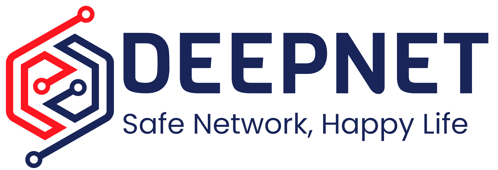

# Port-Net

## Prerequisites
Ensure you have the following installed before proceeding:

- [Node.js](https://nodejs.org/) (version 20 or later)
- [npm](https://www.npmjs.com/) (comes with Node.js)

---

## Setup
Follow these steps to set up the project for development:

### 1. Install Necessary Dependencies
Run the following commands in your terminal:

```bash
# Navigate to the bridge directory and install dependencies
cd ./bridge && npm install

# Navigate to the frontend directory and install dependencies
cd ../frontend && npm install
```

---

### 2. Start the Server
Make sure you are in the **root directory** of the project and run the following command:

```bash
npm run start
```

---

### 3. Access the Web Application
Once the server is running, access the frontend by visiting:

- **Frontend:** [http://localhost:3000](http://localhost:3000)

